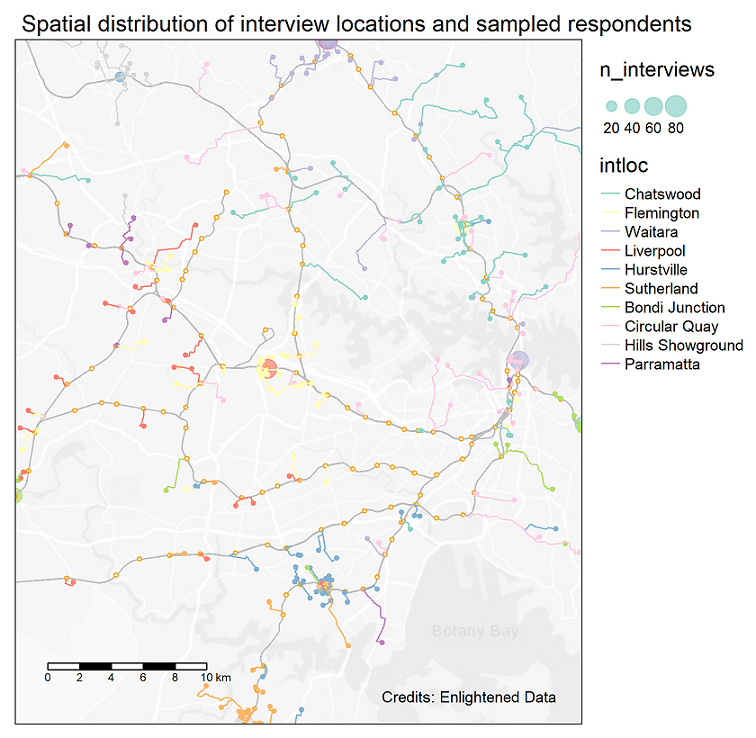
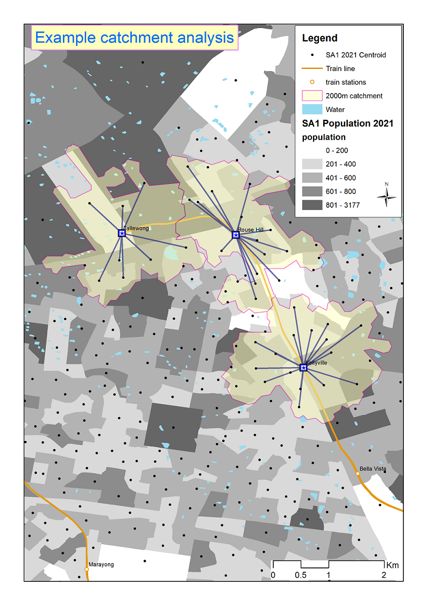
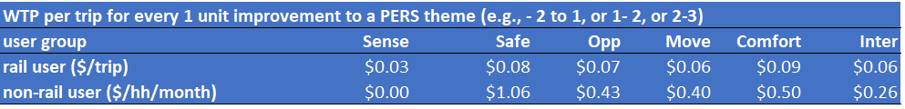

```{r setup, include=FALSE}
knitr::opts_chunk$set(message=FALSE,warning=FALSE, cache=TRUE)
```

Dive into our world of data wizardry through a selection of our standout projects. Each example is a testament to how Enlightened Data's expertise in analysis and modeling can illuminate the path to strategic decisions and impactful solutions.

# Values of Road Safety 
*2017-11-01 to 2024-02-29* Last compiled: `r Sys.Date()`

*Client:* Austroads.

*Methodology:* 

- Data collection: Stated Preference Survey.
- Data analysis: Advanced Choice Modelling.

*Partners:* [Deloitte Access Economics](https://www.deloitte.com/au/en/services/economics.html) and [Taverner Research](https://taverner.com.au/).


## Background
Have you ever pondered how the worth of road safety is gauged by economists, or in other words, how they determine the value of a human life in these analyses? 

The **Value of Statistical Life** (VSL) is a fascinating concept used to tackle these questions, especially when it comes to making our roads safer. Instead of putting a price tag on life itself, VSL estimates how much people are collectively willing to spend to reduce the risk of fatal accidents. For instance, if a group is ready to pay \$50 each for a safety feature that lessens the chance of a fatal car accident by 1 in 100,000, then the VSL is pegged at \$5 million (\$50 x 100,000). This calculation helps in assessing whether the cost of road safety measures, like new traffic signals or stricter speed enforcement, is justified by the benefits, namely saving lives and preventing injuries. It's a way for decision-makers to prioritise safety measures and make informed choices, ensuring that investments in safety deliver the most *bang for the buck* in protecting our communities.

How can modelers estimate the amount of money that **people are collectively willing to spend to reduce road crashes** and **the likelihood of being involved in a certain type of road crash**, such as one that is fatal or results in major injury requiring hospitalization? Economists refer to these concepts as a **Willingness To Pay** (WTP) value and a **crash probability**, respectively. These are two crucial inputs for estimating the VSL.

What do we need to estimate these values? Essentially two things: high-quality data and robust behavioral models.

## Collecting data 
Collecting high-quality data is time-consuming, which is why this project has taken more than five years from its inception in 2017 to its completion in 2024. Clearly, the COVID-19 pandemic severely delayed and disrupted the study. Despite this, multiple waves of data collection, from pilots in selected states to national studies, took a considerable amount of time. Various survey administration methods, including online self-guided, online-guided, and face-to-face interviews, were tested to select the most appropriate method that delivers high-quality data within the budget and timeline.

### Survey administration methods
This study marks the first attempt to use a WTP (Willingness to Pay) approach to simultaneously estimate national values for time, reliability, and safety in road travel. As these values are being determined for the first time, significant time and effort were invested in the design, testing, and review phases before launching a comprehensive national survey.

The survey comprises three phases: design, pilots, and national survey (Wave 1 and Wave 2), with cognitive interviews and feedback between phases to improve the survey instruments. Overall, nothing beats face-to-face interviews, which had to be replaced with online-guided interviews in Wave 2 of the national survey due to *physical distancing* measures imposed by COVID-19.

### The Stated Choice Experiment
At the core of this national WTP (Willingness to Pay) study is an SP (Stated Preference) experiment that presents participants with five sets of route choices, each comprising two options. These options vary in terms of safety, cost, and travel time, with travel time presented as a range to account for different reliabilities (refer to the figure below).

</div>
<div class="col-lg-12">


</div>

The attribute levels (cost, time, reliability, and safety) of the choice experiments were chosen using *Bayesian efficient designs*. These designs optimise the attribute levels based on the trip details reported by each respondent from the background questions preceding the SP experiment. The goal of the Bayesian efficient designs is to minimize the errors in the model coefficient estimates.

### Survey sampling

The survey used a **stratification sampling with quota** to obtain enough samples for the requirement of separate WTP values for different travel purposes. Samples are proportional to the population of each State/Territory. Quotas were also employed for jurisdictions, drivers and passengers, and metropolitan and regional locations to ensure the survey results accurately represented nationwide averages.

In the fieldwork, recruitment took place in both urban and regional settings so that travelers outside major (capital) cities would also be included. The split of the samples (i.e., respondents) between urban vs. rural locations was matched with corresponding statistics derived from the [ABS 2016 Census Journey to Work (JTW)](https://www.abs.gov.au/articles/australias-journey-work) to obtain an expansion factor (i.e., weight) for each observation. In the absence of reliable statistics on the urban/rural split for business and non-work trip purposes, the matching process used statistics from the Census JTW data for all trip purposes. The WTP values estimated from the model were then aggregated using the expansion factors to give weighted average values that could be used consistently for all travellers in all parts of Australia.

### Final sample size
The National Survey captured a large sample of respondents, providing sufficient variation to ensure reliable and statistically significant results. However, the sample size for the National Survey was approximately 650 participants fewer than initially planned, due to challenges in finding certain segments, such as business travel and passenger trips in regional areas, post-COVID-19. The figure below illustrates the shortfall of the final sample compared to the targeted number.


</div>
<div class="col-lg-12">


</div>

Therefore, we endeavor to utilize the pilot samples as much as possible, bringing the total number of samples closer to the target figure.


## Collecting crash probability data

The crash probability, which measures the risk of being involved in road crashes, is necessary for estimating the WTP (Willingness to Pay) to reduce the number of crashes by one for each severity class. The survey included five severity classifications: fatal, incapacitating, major, minor injury, and property damage only. Compared to classifications used by Australian jurisdictions, this study introduced the category of incapacitating injury, deemed necessary to account for the broad range of hospitalization severities, from overnight stays to lifelong incapacities.

The survey instrument displayed the number of crashes in each severity category along the route of the trip over a year. If the modeling were conducted using only SP (Stated Preference) data, the derived WTP value would represent the WTP per trip for reducing the number of crashes in a specific severity category by one per year. This concept is known as the **subjective value of crash risk reduction** (SVCR), which essentially measures how much **people are collectively willing to spend to reduce road crashes**.

For each crash severity, the **Value of Risk Reduction (VRR)** (or **VSL** if it is a fatal risk) is calculated by multiplying the SVCR by the level of crash exposure (number of opportunities for a crash). The exposure measure for each trip per year was determined as the distance-weighted **average annual daily traffic** (AADT) level multiplied by 365 (number of days in a year) for the trip's route. Since crash exposure varies between trips, this conversion was performed at the individual trip level. The number of crashes/year shown in the SP experiment was divided by the distance-weighted AADT multiplied by 365 for the trip to convert it into the **annual probability of a crash** occurring. The WTP value estimated from data expressed in crash probabilities then becomes the required VRR, with no further conversion being needed.

Transport authorities from various states and territories supplied AADT data, which was standardised and indexed by year. In Australia, transport authorities calculate the AADT using traffic count data from counters placed at various locations across the road networks. The placement of these counters, and consequently the data coverage of the AADT, is illustrated in the figure below.

</div>
<div class="col-lg-12">


</div>

It is worth noting that two alternative methods exist for estimating the VRR or VSL (**\$/crash**) using the WTP values derived from the choice model. The first method, adopted by [Hensher et al. (2009)](https://ses.library.usyd.edu.au/bitstream/2123/19286/1/itls_wp_09_03.pdf) in the RTA pilot study (whose WTP estimates have been used in ATAP guidelines), first estimated the SVCR (or WTP (**\$/year**) to reduce 1 road crash of type *i* per year). The SVCR values were then converted to VRR or VSL using an *average crash exposure* estimated from data for *the entire road network* (in the case of the RTA report, it is the NSW road network). The second method, adopted by [Rizzi and Ortuzar (2003)](https://www.sciencedirect.com/science/article/pii/S0001457501000823), converted the numbers of crashes per annum (which differ *systematically* across respondents according to the SP designs) into crash probabilities by dividing the annual crash numbers presented in the SP experiments by the traffic volume along each route prior to estimating the choice models. Choice models that use crash probability deliver the VRR or VSL without further conversion needed. The first approach is easier, as it requires only the jurisdiction-wide average crash exposure; however, this approach may not be satisfactory for a large country like Australia where trips vary markedly by distance, traffic exposure level, and condition of roads. Upon consulting with Prof. Ortuzar and independent reviewers from Leeds University, the Austroads Project Managers decided to adopt the second method for estimating the VRR. To what extent the VRR / VSL derived by these alternative methods differ remains a question that needs to be investigated further. 


## Estimating risk exposure for each trip
Once traffic volume data have been obtained, we need to map this to each trip/route so that crash probabilities can be computed. This is a massive task because we have thousands of routes and tens of thousands of traffic counters across Australia. A programming method is needed because a manual approach would take a very long time (first by digitizing the route, then by mapping the AADT data to each route, and finally by calculating the distance-weighted AADT for each route).

Survey respondents were asked to provide the suburbs of origin and destination for their trips, enabling the determination of an optimal route (shortest time) via Google Maps. A total of 3,885 unique routes were identified for all origin-destination pairs among the surveyed individuals, excluding intra-zonal trips. The reported trips covered a broad geographical area of Australia, ranging from urban to regional locations. AADTs for the route segments of each trip were estimated for all identified routes observed in the entire survey sample. Given that the AADT varies along each trip's route, a distance-weighted average was calculated after mapping the traffic count data to each route and dividing it into segments. The figure below illustrates the developed method, using an example route from Bankstown to Mount Druitt in Sydney, which passed through several traffic counters (represented by dots) that provide AADT data (shaded in different colours).

</div>
<div class="col-lg-12">


</div>

## Developing behavioural models

When it comes to model development, there are no shortcuts. We used an iterative process of testing different model specifications, validating the results, and selecting the best models based primarily on their *behavioural outputs* (elasticity, willingness to pay, marginal rate of substitution) and secondarily on statistical tests such as model *goodness of fit*. Literally, hundreds of models have been estimated to find the best one. Although automation and programming can make this process somewhat less daunting, there are truly no shortcuts.

</div>
<div class="col-lg-12">


</div>


## Estimating the VSL
```{r echo=FALSE, message= FALSE, include=FALSE}
# library(tidyverse)
# library(knitr)
# # devtools::install_github("haozhu233/kableExtra")
# 
# library(kableExtra)
# library(xtable) # load xtable
# 
# vrr <- read_csv("./data/VRR.csv") %>% 
#   select(1:2,) %>% tail(5)
```
Once the best model has been found, we can use it to derive the economic values, which in this case, are the value of risk reduction or VSL. [ATAP](https://www.atap.gov.au/mode-specific-guidance/active-travel/5-estimation-of-benefits) will publish these values in due course for the estimation of benefits of transport and safety projects. 


# Valuing Urban Realm
*2023-05-20*

*Client:* Sydney Metro

*Methodology:* 

- Data collection: Stated Preference Survey
- Data analysis: Best-Worst Choice Modelling

*Partners:* [Deloitte Access Economics](https://www.deloitte.com/au/en/services/economics.html) and [Taverner Research](https://taverner.com.au/)

## Objectives
The amenity benefits derived from the improved urban realm in station precincts are increasingly recognized as a critical part of a transport project's development and are receiving more focus from project teams. However, the approaches to valuing and incorporating these considerations into project option design and business cases are not suitable for the modern-day Australian context.

To address these limitations, Sydney Metro engaged Deloitte Access Economics and Enlightened Data to develop contemporary WTP (Willingness to Pay) values for amenity benefits from improved public realm attributes in station precincts. The WTP values were to be derived in units that were more suitable for their intended purpose, such as on a per householder or per trip basis.

## Data collection
We use SP (Stated Preference) surveys to understand how people might behave in different environments within a station precinct. In these experiments, respondents are asked to choose between different options that exhibit both desirable and undesirable characteristics. We design a Best-Worst experiment based on the review of similar studies and input from the clients.

We collaborate with Taverner, who recruited and conducted face-to-face surveys across 10 stations in Sydney. The interview locations and respondents are shown in the figure below. These locations were chosen to encompass the geography of Greater Sydney as well as to include different types of station users such as residents, visitors, and non-rail users.

</div>
<div class="col-lg-12">


</div>


## Analysis method

### Best-Worst model
Numerous models were tested and estimated. The best model, identified through log-likelihood ratio tests, took the form of a Best-Worst Generalized Mixed Logit model type II, also known as a hybrid model of scaled MNL (Multinomial Logit) and mixed logit. With a sample size of over 400 respondents, the Best-Worst survey and modeling technique help us double the number of observations, which in turn delivers more reliable parameters and, consequently, more accurate WTP (Willingness to Pay) values.

### Catchment analysis
Once the WTP values were estimated, we needed to apply these values to the case of Sydney. To achieve this, a catchment analysis was conducted to estimate the monthly number of train trips per visitor and per resident, respectively. An example is illustrated in the figure below.

</div>
<div class="col-lg-12">


</div>

## Outcomes
For the application of these WTP (Willingness to Pay) values in business cases and economic appraisals, it is essential to convert the WTP estimates provided by the best model into value per use (i.e., $/train trip). Catchment analyses were conducted using four alternative catchments of 500m, 800m, 1000m, and 1200m walking distances from each of the 10 interview locations. The resulting catchments were then overlaid with Sydney HTS (Household Travel Survey) data to estimate the average number of train trips per household per month. The 500m catchment yielded the highest average number of monthly train trips per household (31.72). For catchments ranging from 800m to 1200m, the average number of monthly train trips per household stabilized at around 27 trips/household/month.

Using this average, we calculate the average WTP per use for rail users. To estimate the annual non-use value in business cases, one can simply multiply the $/household/month by 12 months and the total number of non-rail households residing within the station precinct (e.g., within 1km).

</div>
<div class="col-lg-12">


</div>

For more information, please see our paper published in [Australasian Transport Research Forum (ATRF)](https://australasiantransportresearchforum.org.au/measuring-amenity-benefits-of-public-realm-in-railway-station-precincts/) 