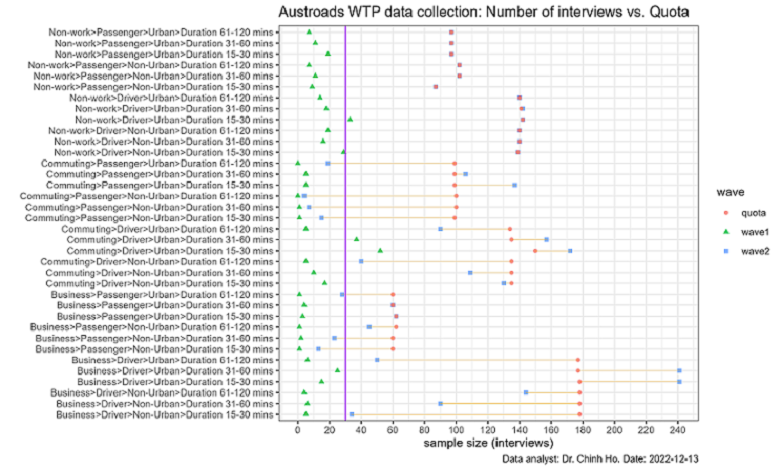
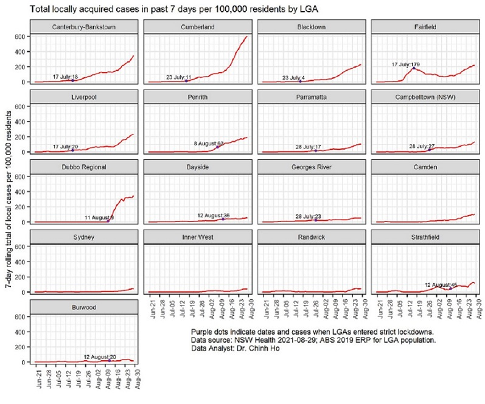

```{r setup, include=FALSE}
knitr::opts_chunk$set(message=FALSE,warning=FALSE, cache=TRUE)
```

Dive into our world of data wizardry through a selection of our standout projects. Each example is a testament to how Enlightened Data's expertise in analysis and modeling can illuminate the path to strategic decisions and impactful solutions.

# Values of Road Safety 
*2017-11-01 to 2024-02-29* Last compiled: `r Sys.Date()`

*Client:* Austroads.

*Methodology:* 

- Data collection: Stated Preference Survey.
- Data analysis: Advanced Choice Modelling.

*Partners:* [Deloitte Access Economics](https://www.deloitte.com/au/en/services/economics.html) and [Taverner Research](https://taverner.com.au/).


## Background
Have you ever pondered how the worth of road safety is gauged by economists, or in other words, how they determine the value of a human life in these analyses? 

The **Value of Statistical Life** (VSL) is a fascinating concept used to tackle these questions, especially when it comes to making our roads safer. Instead of putting a price tag on life itself, VSL estimates how much people are collectively willing to spend to reduce the risk of fatal accidents. For instance, if a group is ready to pay `$`50 each for a safety feature that lessens the chance of a fatal car accident by 1 in 100,000, then the VSL is pegged at `$`5 million (`$`50 x 100,000). This calculation helps in assessing whether the cost of road safety measures, like new traffic signals or stricter speed enforcement, is justified by the benefits, namely saving lives and preventing injuries. It's a way for decision-makers to prioritise safety measures and make informed choices, ensuring that investments in safety deliver the most *bang for the buck* in protecting our communities.

How could modellers estimate the amount of money that **people are collectively willing to spend to reduce road cashes** and **the chance of involving in a certain type of road crash** such as fatal or major injury that requires hospitalisation? Economists term these concepts a **Willingness To Pay** (WTP) value and a **crash probability**, respectively. These are the two vital inputs for the estimation of the VSL. 

What do we need the estimate these values? Two things, really. High quality data and good behavioural models. 


## Collecting data 
Collecting high quality data is time-consuming and this is the reason why this project takes more than 5 years from inception (2017) to completion (2024). Obviously, the Covid-19 pandemic severely delayed and disrupted the study. Not withstanding this, multiple waves of data collection, from pilots in selected states to a national studies, took a lot of time. Multiple survey administration methods, including online self-guided to online-guided and face2face interviews were tested to select the most appropriate method that delivers high quality data within the budget and timeline. 

### Survey administration methods
This study marks the first attempt to use a WTP (Willingness to Pay) approach to simultaneously estimate national values for time, reliability, and safety in road travel. As these values are being determined for the first time, significant time and effort were invested in the design, testing, and review phases before launching a comprehensive national survey.

The survey comprises three phases: design, pilots, and national survey (wave 1 and wave 2) with cognitive interviews and feedback between phases to improve the survey instruments. Overall, nothing beats face2face interviews, which had to be replaced with online-guided interviews in Wave 2 of the national survey due to *physical distancing* measures imposed by Covid-19.   

### The Stated Choice Experiment
Centred to this national study of WTP is a SP experiment that face the participants five sets of route choices, each choice consisted of two options. The two options had varying estimates of safety, cost, and travel time, where travel time was given as a range to reflect differing reliabilities (see Figure below). 

</div>
<div class="col-lg-12">


</div>

The attribute levels (cost, time, reliability, and safety) of the choice experiments were chosen using *Bayesian efficient designs*. These optimise the attribute levels based on each respondent’s reported trip details obtained from the background questions that preceed the SP experiment. The aim of the *Bayesian efficient designs* is to minimise the standard deviations of errors in the model coefficient estimates.

### Survey sampling

The survey used a **stratification sampling with quota** to obtain enough sampels for the requirement of separate WTP values for different travel purposes. Samples are proportionate to the population of each State/Territory. Quotas were also employed for jurisdictions, drivers and passengers, and metropolitan and regional locations to ensure the survey results accurately represented nationwide averages.

In the field work, recruitment took place in both urban and regional settings so that travellers outside major (capital) cities would also be included. The split of the samples (i.e., respondents) between urban vs. rural location was matched with corresponding statistics derived from the [ABS 2016 Census Journey to Work (JTW)](https://www.abs.gov.au/articles/australias-journey-work) to obtain an expansion factor (i.e., weight) for each observation. In the absence of reliable statistics on urban/rural split for business and non-work trip purpose, the matching process used statistics for the Census JTW data for all trip purposes. The WTP values estimated from the model were then aggregated using the expansion factors to give weighted average values that could be used consistently for all travellers in all parts of Australia.

### Final sample size
The National Survey captured a large sample of respondents and provided enough variation to ensure reliable and statistically significant results. However, the sample for the National Survey had approximately 650 fewer participants than initially planned, as some segments such as business travel and passenger trips in regional areas were extremely difficult to find post Covid-19. The figure below shows the shortfall of the final sample vs. targeted number.  

</div>
<div class="col-lg-12">


</div>

Thus, we try to use the pilot samples as much as possible. This brings the total sample closer to the target number. 


## Collecting crash probability data

The crash probability, measuring the risk of exposing to road crashes is needed to estimate the WTP for reducing the number of crashes by one, for each severity class. Five severity classifications were represented in the survey. They correspond with fatal, incapacitating, major, minor injury and property damage only. Comparing to the classifications used by Australian jurisdictions, the study introduced the incapacitating injury which was considered necessary because the range of severities for hospitalised injuries is very large, ranging from an overnight stay to life-long incapacity.

The survey instrument presented the numbers of crashes in each severity category along the route of the trip over a period of a year. If the modelling was undertaken using SP data alone, the WTP value obtained would be WTP per trip for a reduction in the number of crashes, in a given severity category by one per year. This is termed the **subjective value of crash risk reduction** (SVCR).

For a given crash severity, the **Value of Risk Reduction** (VRR) is obtained by multiplying the SVCR by the level of crash exposure (number of opportunities for a crash) in a year. The exposure measure for each trip per annum was taken as the distance-weighted **average annual daily traffic (AADT)** level times 365 along the route of the trip. As the level of crash exposure varies between trips, the conversion was undertaken at the individual trip level. The number of crashes in each survey response was divided by the distance-weighted AADT times 365 for the trip to convert it to the annual probability of a crash occurring. The WTP value estimated from data expressed in crash probabilities is then the required VRR. 

Transport authorities from various states and territories provided AADT data, which was standardised and indexed by year. Transport authorities in Australia estimate the AADT using traffic count data obtained from counters placed at various points/stations across the road networks. The location of these counters, and hence data coverage of the AADT, is shown in the Figure below. 

</div>
<div class="col-lg-12">


</div>

Survey respondents were asked to provide the suburb of origin and destination of their trips, allowing for an optimal route (shortest time) to be determined through Google Maps. There were 3,885 unique routes identified for all origin-destination pairs, across all surveyed people, excluding intra-zonal trips. The reported trips span a wide geographical area of Australia and spread between urban and regional areas. AADTs for segments along the route for each trip were estimated for all identified routes across the entire survey sample. Since the AADT varies over the length of the route for each trip, the distance-weighted average was taken after snapping the traffic count data to each route and split it up to segments. The Figure below shows an example route between Bankstown and Mount Druitt in Sydney which went through a few traffic counters that provide the AADT data. 

</div>
<div class="col-lg-12">


</div>


## Developing behavioural models

When it comes to model development, there is no shortcut. It is an interactively process of testing different model specifications, validating the results, and selecting the best models based firstly on their *behavioural outputs* (elasticity, willingness to pay, marginal rate of substitution) and secondly on statistical tests such as model *goodness of fit*. Literal, hundreds of models have been estimated such that the best one can be found. While automation and programming help us make this process a bit less daunting, there is really no shortcut.  

</div>
<div class="col-lg-12">


</div>


## Estimating the VSL
```{r echo=FALSE, message= FALSE, include=FALSE}
# library(tidyverse)
# library(knitr)
# # devtools::install_github("haozhu233/kableExtra")
# 
# library(kableExtra)
# library(xtable) # load xtable
# 
# vrr <- read_csv("./data/VRR.csv") %>% 
#   select(1:2,) %>% tail(5)
```
Once the best model has been found, we can use it to derive the economic values, which in this case, are the willingness to pay for time saving and risk reduction. [ATAP](https://www.atap.gov.au/mode-specific-guidance/active-travel/5-estimation-of-benefits) will publish these values in due course for the estimation of benefits of transport and safety projects. 


# Navigating COVID-19 with Data Analytics

2021-08-29 Last compiled: `r Sys.Date()`

While Sydneysiders were in lockdowns, Enlightened Data embarked on a critical mission during the challenging times of the COVID-19 pandemic. Harnessing the power of advanced data visualization, our team developed an intuitive, real-time tracking tool that painted a vivid picture of the virus's spread across the city. This innovative platform not only provided citizens and health authorities with an immediate understanding of outbreak hotspots but also enabled the strategic deployment of healthcare resources and the implementation of targeted lockdown measures. Through this project, Enlightened Data demonstrated the impactful role of data visualization in managing public health crises, offering a beacon of clarity amidst the uncertainty of a global pandemic.


## The strict lockdown in Sydney Metropolitan area
Starting in an Eastern suburb of Randwick, Delta quickly spread to Fairfield and sent this Local Government Areas (LGA) and adjacent areas to a strict lockdown in mid July 2021. Residents of these areas were ordered to stay strictly inside their home and can only go out for *essential purposes* such as going to work, education, grocery shopping, and medical purposes. Schools and playgrounds were closed to reduce the risk of Delta spreading further. In addition, families of the so-called LGA of concerns were only allowed to do exercise for **up-to one-hour outside their homes and they must be wearing a facemask**. This was perhaps the darkest period of Sydney lockdown. 


## Sydney lockdown 2021: Was it too little too late?
*2021-08-29*

Apparently so. But there is little point of criticizing the NSW government for what they did not know at the time (that Delta is a game-changer). 
With the Greater Sydney is in week #10 of lockdown, is there something that the NSW government can learn to slow Delta spread, first to buy time to vaccine us out of the current lockdown, and second to reduce the pressure on our healthcare systems. 
The answer is yes, based on an analysis of locally acquired cases shown in the Figure below. We suggest two pressing moves to avoid the same mistake and buy us time.

- Add Camden to the LGA of concern NOW. NSW Health has been watching Camden, but I wonder what they are waiting for. 
- Change the cases tracking from 14-day to 7-day rolling total and half the trigger (50 to 25 or 30) to allow quicker responses. 
- (Bonus) Closely watch Randwick, Inner West and Sydney. 

</div>
<div class="col-lg-12">


</div>


In the last 7 days, Camden has more than 100 cases per 100,000 residents, twice the adopted threshold that would trigger for any area to go back into lockdown, according to the State plans to implement a staggered return for schools from 25 October 2021. The evidence, interpreted below, suggests that it may have been too late for Camden (I would bet my money for this).

1. Fairfield was under 'the ring of steel' on 17 July when the total local cases in the prior seven days were 179 cases per 100,000 residents. The LGA has seen cases reduced, but when restrictions were relaxed (eg no more requirement to test every 3 days for most authorised workers), cases started to increase again, and is now standing at the same level at when it was entered the strictest restrictions. 
2. Canterbury-Bankstown and Liverpool, both share their borders with Fairfield, also entered the lockdown on the same date (17 July) when cases were low (18 & 20) but with fewer restrictions (authorised workers didn't need tests every 3 days). By the time they were bearing the same restrictions in early August, cases per 100,000 residents had approximated or exceeded 100, and have increased since, rapidly! 
3. Cumberland was added to the list of concern quite early when cases per 100,000 residents was only 11. But since cases exceeded 100, they increased rapidly and is now at the centre of the NSW outbreak (cases per resident increased 3 times in less than 4 weeks).
4. Burwood, Georges River, and Bayside have been resilient in keeping cases under 100 per 100,000 residents. ALL entered a stricter lockdown when cases were low (20, 23, and 36), so were Parramatta and Campbelltown LGAs (17 and 27). The last two LGAs have been successfully, to some extent, in keeping the cases below 100 for nearly 10 weeks, buying precious time for vaccination. In comparison, Strathfield entered lockdown at 45, which took less than 5 weeks to reach 100. 
5. Camden is now at the breaking point. 


## Data speaks volume
*2021-09-12*

We have warned a week ago that NSW Health should pay close attention to the spread of Delta in Sydney, Randwick and Inner West LGAs. Two of these three LGAs are now seeing cases increased rapidly. Who knows what happens this week, after the [last weekend warm weather when thousands flocked to beaches](https://www.9news.com.au/national/sydneysiders-flock-to-beaches-as-temperatures-soar/00b0cda9-7dfe-4358-be6a-944b835913c5), many in Randwick.

<video controls>
  <source src="videos/active_cases_LGA_metro.mp4" type="video/mp4">
  Your browser does not support the video tag.
</video>


## How quickly Delta strain spread to regional NSW 
*2021-09-19*

Have NSW cases peaked? 
Likely so, but that varies by where you were in NSW. In most of the 12 LGAs of concern, cases trended down in the last two weeks. In Central Coast and South Coast, however, cases are still increasing rapidly. 

The worst is over for the Southwest areas but regional NSW is bearing the load... 

<video controls>
  <source src="videos/active_cases_LGA.mp4" type="video/mp4">
  Your browser does not support the video tag.
</video>


# Valuing Urban Realm
*2023-05-20*

*Client:* Sydney Metro

*Methodology:* 

- Data collection: Stated Preference Survey
- Data analysis: Best-Worst Choice Modelling

*Partners:* [Deloitte Access Economics](https://www.deloitte.com/au/en/services/economics.html) and [Taverner Research](https://taverner.com.au/)

## Data collection

## Analysis method

## Outcomes